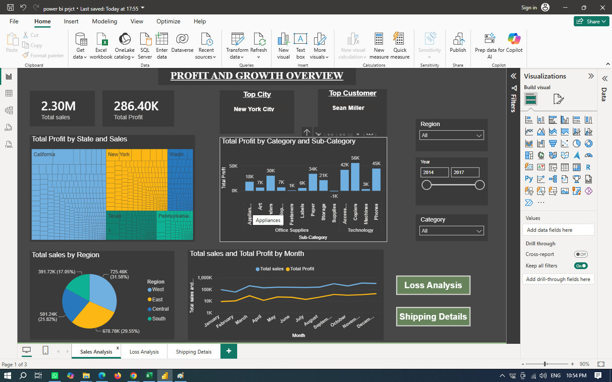
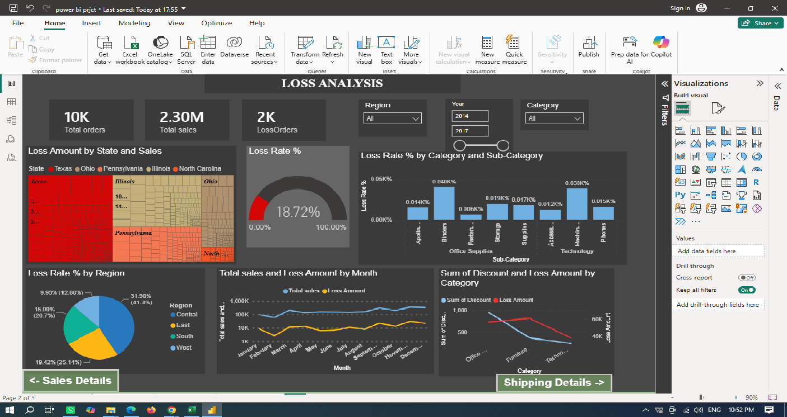
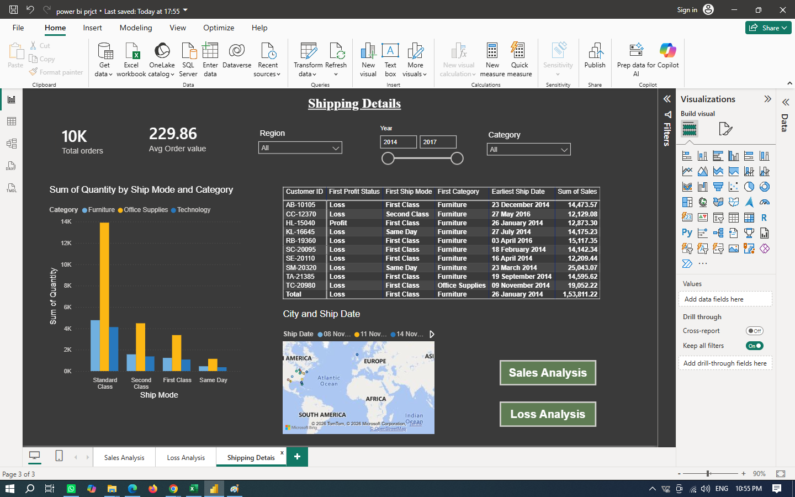

Superstore Sales & Profit Performance Analysis

📌 1. About the Project

This project focuses on analyzing the Sample Superstore retail sales dataset using Microsoft Excel and Power BI.

The main objectives of this project are:

- Analyze overall sales and profit performance.
- Identify profitable and loss-making products.
- Analyze sales and profit by category, sub-category, and region.
- Analyze customer and geographical performance.
- Analyze shipping performance.
- Identify important business insights.
- Provide recommendations based on the analysis.

Project Phases

Phase 1: Data preprocessing and transformation using Excel.

Phase 2: Interactive dashboard creation and analysis using Power BI.

---

📂 2. Data Collection

The dataset used for this project is the Sample Superstore Dataset.

The dataset contains information about:

- Orders
- Customers
- Products
- Categories and Sub-Categories
- Sales
- Quantity
- Discount
- Profit
- Regions
- States and Cities
- Shipping Modes
- Order Dates and Shipping Dates

The original raw dataset is included in this repository:

"Superstore_Raw_Data.csv"

---

🧹 3. Phase 1 – Data Preprocessing in Excel

The raw dataset was cleaned and transformed using Microsoft Excel before importing it into Power BI.

Data Cleaning Activities

3.1 Duplicate Check

- Checked the dataset for duplicate records.
- No exact duplicate records were found.

3.2 Missing Value Check

- Checked all columns for missing or blank values.
- No missing values were found in the supplied dataset.

3.3 Date Standardization

The following fields were converted into proper date format:

- "Order Date"
- "Ship Date"

This helped in performing time-based analysis.

3.4 Discount Standardization

The "Discount" field was standardized into a numeric percentage format for analysis.

3.5 Postal Code Standardization

Postal Code values were standardized into an appropriate numeric-compatible format.

3.6 Calculated Fields

The following calculated fields were created:

Calculated Field| Purpose
"Profit Status"| Identifies whether a record is Profit or Loss
"Order Year"| Extracts the year from Order Date
"Shipping Days"| Calculates the number of days between Order Date and Ship Date

Challenges Faced

The main challenges during preprocessing were:

- Standardizing date formats.
- Converting percentage values into numeric format.
- Preparing the data for Power BI.
- Working with a large number of columns and records.
- Creating useful calculated fields for analysis.

The processed Excel file is included as:

"Superstore_Preprocessed.xlsx"

---

📊 4. Phase 2 – Power BI Dashboard

The cleaned data was imported into Microsoft Power BI to create an interactive dashboard.

4.1 Sales Analysis

The Sales Analysis page includes:

- Total Sales
- Total Profit
- Sales by Category
- Profit by Category
- Sales and Profit by Sub-Category
- Regional Analysis
- State-level Analysis
- Monthly Sales and Profit Trend
- Customer Analysis
- City Analysis
- Interactive Slicers

---

4.2 Loss Analysis

The Loss Analysis page focuses on identifying and understanding loss-making orders.

It includes:

- Total Orders
- Total Sales
- Loss Orders
- Loss Rate %
- Loss Amount
- Loss Rate by Category
- Loss Rate by Sub-Category
- Loss Amount by State
- Loss Rate by Region
- Monthly Sales vs Loss Amount
- Discount vs Loss Analysis
- Interactive Slicers

---

4.3 Shipping Details

The Shipping Details page analyzes shipping and order performance.

It includes:

- Quantity by Ship Mode
- Quantity by Category
- Total Orders
- Average Order Value
- Customer Details
- Profit Status
- Ship Mode
- Category
- Ship Date
- Sales
- City
- Interactive Slicers

---

🧮 4.4 DAX Measures Performed

Total Sales

Total sales = SUM('Cleared Data'[Sales])

Total Profit

Total Profit = SUM('Cleared Data'[Profit])

Total Orders

Total orders = DISTINCTCOUNT('Cleared Data'[Order ID])

Average Order Value

Avg Order value =
DIVIDE([Total sales], [Total orders], 0)

Loss Orders

LossOrders =
CALCULATE(
    [Total orders],
    'Cleared Data'[Profit] < 0
)

Loss Amount

Loss Amount =
-CALCULATE(
    SUM('Cleared Data'[Profit]),
    'Cleared Data'[Profit] < 0
)

Loss Rate %

Loss Rate % =
DIVIDE([LossOrders], [Total orders], 0)

---

🖼️ 4.5 Dashboard Screenshot

Add your Power BI dashboard screenshot here.

Save the screenshot in the repository, for example:##  Data Collection
*   **Source Data:** The analysis is built upon a raw dataset. This dataset was sourced from [Kaggle](https://www.kaggle.com/code/zainabmim/retail-sales-performance-analysis/input)(Retail-Sales-performance-Analysis)

---

💡 5. Findings / Insights

Sales & Profit

- Total Sales are approximately $2.30M.
- Total Profit is approximately $286.40K.
- Technology is the strongest category in terms of sales and profit.

Category Analysis

- Technology has the highest sales and profit.
- Furniture has relatively high sales but comparatively low profit.
- Office Supplies contributes significantly to both sales and profit.

Regional Analysis

- The West region has the highest sales and profit.
- The South region has comparatively lower sales.

Loss Analysis

- Several orders generate negative profit.
- Tables is one of the major loss-making sub-categories.
- Bookcases also show negative profitability.
- Higher discounts should be carefully monitored because they can affect profit margins.

Shipping Analysis

- Standard Class is the most frequently used shipping mode.
- Standard Class contributes significantly to overall sales and profit.

---

💡 6. Suggestions / Recommendations

1. Review loss-making products
   Analyze products such as Tables and Bookcases to identify the reasons for negative profit.

2. Control discounts
   Avoid excessive discounts, especially for products with low profit margins.

3. Improve Furniture profitability
   Review pricing, product costs, and discount strategies for Furniture.

4. Focus on high-performing regions
   Continue developing successful regions such as the West.

5. Improve low-performing regions
   Analyze lower-performing regions and identify opportunities for increasing sales.

6. Monitor shipping performance
   Analyze shipping modes and delivery times to improve operational efficiency.

7. Regular dashboard monitoring
   Use the Power BI dashboard regularly to monitor sales, profit, losses, and regional performance.

---

🛠️ 7. Tools Used

Tool| Purpose
Microsoft Excel| Data cleaning and preprocessing
Microsoft Power BI| Data analysis and dashboard creation
DAX| Creating calculated measures
GitHub| Project repository and version control

---

📁 8. Repository Files

Superstore-Sales-Analysis/
│
├── Superstore_Raw_Data.csv
├── Superstore_Preprocessed.xlsx
├── Superstore_Sales_Profit_Dashboard.pbix
└── README.md

File| Description
"Superstore_Raw_Data.csv"| Original raw dataset
"Superstore_Preprocessed.xlsx"| Cleaned and transformed Excel file
"Superstore_Sales_Profit_Dashboard.pbix"| Power BI dashboard
"README.md"| Project documentation

---

🔄 9. Project Workflow

Raw Data
    ↓
Excel Data Cleaning & Preprocessing
    ↓
Data Transformation
    ↓
Power BI Data Model
    ↓
DAX Measures
    ↓
Interactive Dashboard
    ↓
Findings & Insights
    ↓
Recommendations

---

👩‍💻 Project

Superstore Sales & Profit Performance Analysis

Tools: Microsoft Excel | Microsoft Power BI | DAX | GitHub
